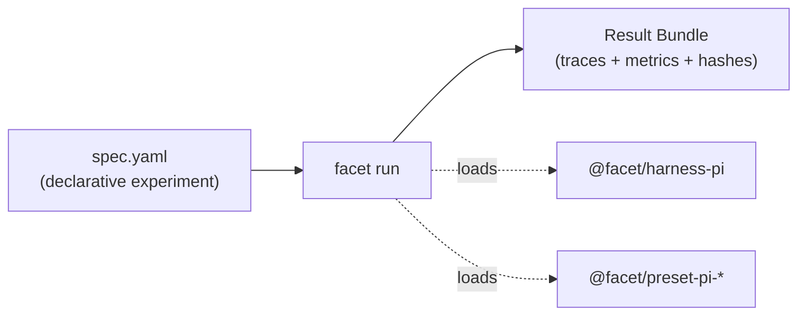

# FACET documentation

FACET is an extensible evaluation layer for code agents. You declare every knob
of an agent — model, tool allowlist, system prompt, extensions, prompt phrasing,
scenario, harness params — as an independent variable, run a deterministic matrix
of those variables, and get one reproducible **Result Bundle** per experiment.

This folder explains how the system works and how to run it. Each document is
short and single-purpose. Start with the overview, then jump to whatever you need.

## Map

## Understand

- [Overview](overview.md) — what FACET is, the *run* as unit of work, the factor → matrix → bundle model.
- [The evaluation layer](evaluation-layer.md) — why FACET is a layer, by analogy with RAG.
- [Design principles](design-principles.md) — the three principles and the design-decision synthesis.
- [Architecture](architecture.md) — the three rings, the eight seams, and dynamic plugin loading.

## Per-package reference

- [`@facet/sdk`](packages/sdk.md) — the eight extension contracts (seams).
- [`@facet/core`](packages/core.md) — the runtime: registries, validator, runner, tracer, bundle writer, CLI.
- [`@facet/harness-pi`](packages/harness-pi.md) — the reference harness and the translate boundary.
- [Profile presets](packages/presets.md) — the six distributable `@facet/preset-pi-*` packages.

## Do

- [Quickstart](guides/quickstart.md) — run `ring-default-specific` end to end (free model).
- [CLI reference](guides/cli.md) — `facet spec show / validate`, `facet hash-profile`, `facet run`.
- [Extending FACET](guides/extending.md) — add a harness, factor, metric, evaluator, emitter, or workspace strategy.

## Look up

- [Experiment spec](reference/experiment-spec.md) — the anatomy of `spec.yaml`.
- [Run lifecycle](reference/run-lifecycle.md) — what `facet run` does, phase by phase.
- [Result Bundle](reference/result-bundle.md) — the output directory and per-run files.
- [Reproducibility](reference/reproducibility.md) — input hashing, normalization, pinning.
- [Glossary](reference/glossary.md) — precise definitions of the core terms.

## Ecosystem

- [CI layer](ecosystem/ci-layer.md) — the `facet-gh-actions` composite GitHub Action.
- [TaskFlow](ecosystem/taskflow.md) — generating Experiment Packages from a real repository.
