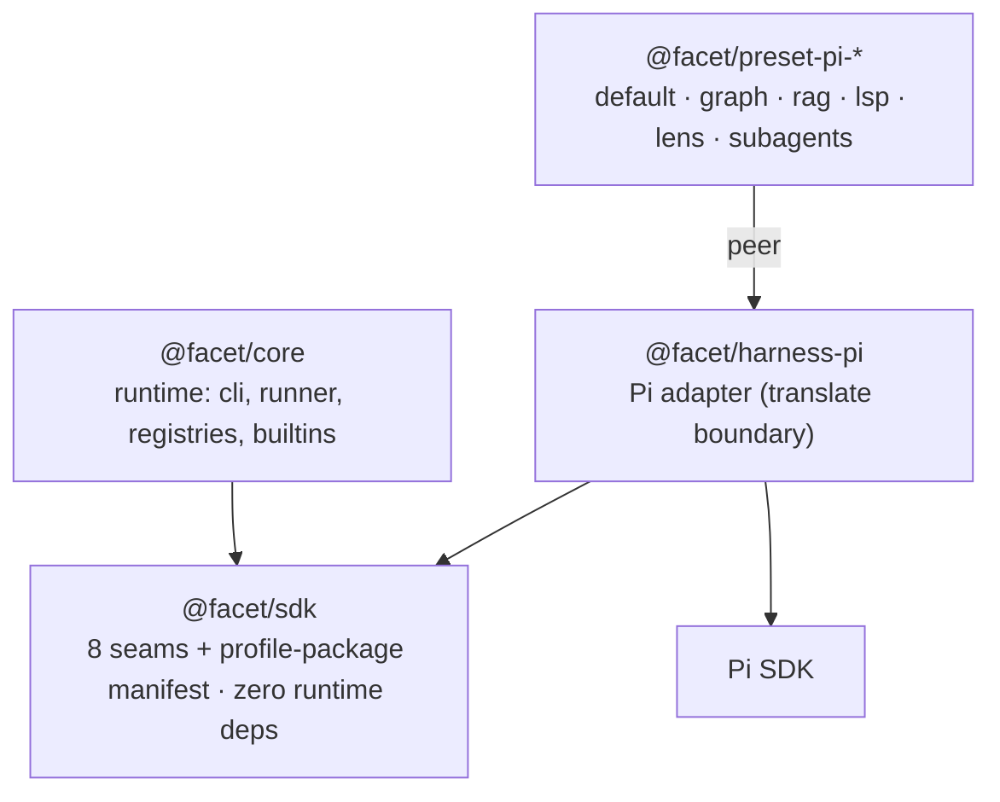
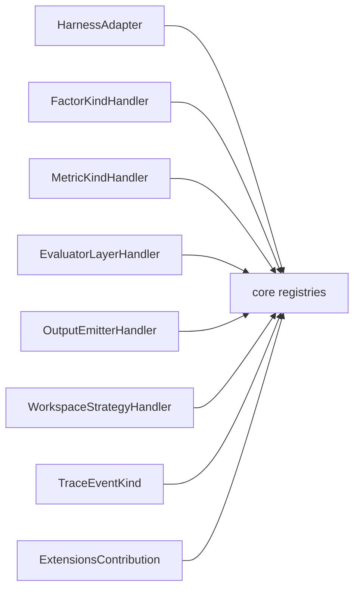
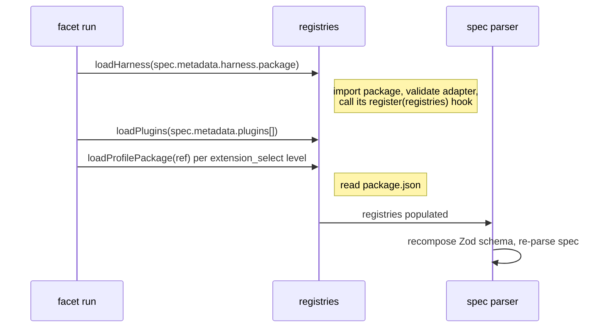

# Architecture

- [Three rings](#three-rings)
- [The eight seams](#the-eight-seams)
- [Dynamic loading](#dynamic-loading)
- [Per-package detail](#per-package-detail)

## Three rings

FACET ships as a pnpm workspace with three roles plus a family of distributable
presets. Dependency arrows always point inward, toward the SDK. Nobody imports
the core to extend FACET.

| Ring | Package | Depends on |
|---|---|---|
| 1 — contracts | `@facet/sdk` | nothing (`zod` peer) |
| 2 — runtime + adapters | `@facet/core`, `@facet/harness-pi` | `@facet/sdk` (+ Pi SDK for the harness) |
| 3 — distributable | `@facet/preset-pi-*` | `@facet/harness-pi` (peer) |

Splitting the SDK from the core is the load-bearing decision. A contributor who
adds a harness, factor, or metric depends only on `@facet/sdk` — no runtime, no
coupling to builtins. The core gets no privileged path: it imports the same types
and helpers an external author would. FACET's own builtins (four factor kinds,
six trace event kinds, one evaluator layer, two output emitters, one workspace
strategy) live in `packages/core/src/builtins/` and register through the same
`defineX()` helpers a plugin calls.

## The eight seams

The SDK exposes one entry point per seam, each with an interface and a
`defineX()` helper. A seam is a typed socket; FACET builtins and third-party
plugins plug in with no privilege difference.

| Seam | What it lets you swap | Builtins |
|---|---|---|
| `HarnessAdapter` | The agent under test (Pi, Aider, OpenHands…) | Pi (via `@facet/harness-pi`) |
| `FactorKindHandler` | A kind of varying factor | `prompt_swap`, `extension_select`, `model_swap`, `model_param` |
| `MetricKindHandler` | A metric derived over the trace | Pi adds 3 (see [harness-pi](packages/harness-pi.md)) |
| `EvaluatorLayerHandler` | A post-run evaluation layer | `oracle_script` |
| `OutputEmitterHandler` | How aggregated results serialize | `results_table_csv`, `results_table_jsonl` |
| `WorkspaceStrategyHandler` | How a workspace is isolated per run | `git_worktree` |
| `TraceEventKind` | A trace event type | 6 lifecycle events |
| `ExtensionsContribution` | Harness-specific blocks in `extensions.yaml` | Pi adds `pinned_agents`, `language_servers` |

A ninth, cross-cutting contract — `ProfilePackageManifestSchema` — defines the
`package.json#facet` block of a [profile package](packages/presets.md). Full
detail in [`@facet/sdk`](packages/sdk.md).

## Dynamic loading

The CLI populates the registries at startup, then the spec parser composes the
active schemas. `facet run` loads extensions at three points:

The consequence: no core component knows a plugin's name. Dispatch is always by
`id` against a registry. The [run lifecycle](reference/run-lifecycle.md) doc
follows the flow past this point.

## Per-package detail

- [`@facet/sdk`](packages/sdk.md) — the contracts.
- [`@facet/core`](packages/core.md) — the runtime.
- [`@facet/harness-pi`](packages/harness-pi.md) — the reference adapter.
- [Profile presets](packages/presets.md) — the six distributable packages.
