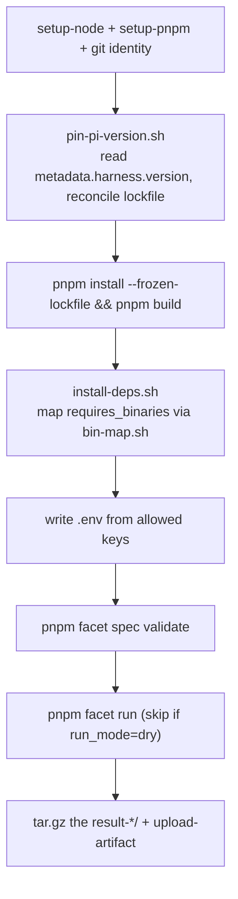

# CI layer

FACET's continuous-integration layer ships as a separate repository,
`facet-eval/facet-gh-actions`, referenced as the composite action
`facet-eval/facet-gh-actions/facet@v1`. Keeping it apart is deliberate: the
runtime and the actions version on their own cadences, with immutable tags
(`v0.x.0` plus a rolling `v1`), and each consumer pins both layers independently.

- [What it does](#what-it-does)
- [Inputs and outputs](#inputs-and-outputs)
- [Two auditability decisions](#two-auditability-decisions)
- [Wiring it up](#wiring-it-up)

## What it does

The action treats `pnpm facet` as a black box. Its steps, in order:



Only `OPENROUTER_API_KEY`, `ANTHROPIC_API_KEY`, and `OPENAI_API_KEY` are written
to `.env` from the caller's `env:`.

## Inputs and outputs

Key inputs (all have defaults except `spec_path`):

| Input | Default | Purpose |
|---|---|---|
| `spec_path` | *(required)* | the Experiment Package directory |
| `command` | `run` | `run`, `validate`, `spec-show`, `hash-profile` |
| `run_mode` | `full` | `full` matrix, `single` first cell, `dry` validate only |
| `artifact_mode` | `minimal` | `minimal` keeps `aggregated/` + `tests.json` + `summary.json` + `manifest.yaml`; `full` includes `trace.jsonl` and `workspace/` |
| `facet_repo_path` | `.` | path to the checked-out runtime |
| `retention_days` | `7` | artifact retention |

Outputs: `result_bundle_path`, `result_bundle_name`, `artifact_name`,
`exit_code`, `run_count` (parsed from `manifest.yaml`).

## Two auditability decisions

**The trust boundary lives in `bin-map.sh`.** The binary-to-package map (`cc` →
`gcc`, `clangd` → `clangd-12`, `pylsp` → `python3-pylsp`, …) sits in one bash
file: no PPAs, no `curl | bash`, no floating versions. The PR template requires
two reviewers to edit it.

**Cost gating happens in the runtime, not in CI.** The spec's
`max_total_cost_usd` cap is enforced by the `BudgetTracker` inside
`pnpm facet run`, not by the workflow. The same cap applies to a local run or a
future runner on another CI platform.

## Wiring it up

The consumer does two checkouts — its Experiment Package and a side checkout of
`facet-eval/facet-system` — then calls the action:

```yaml
- uses: actions/checkout@v4
- uses: actions/checkout@v4
  with:
    repository: facet-eval/facet-system
    path: .facet-system
- uses: facet-eval/facet-gh-actions/facet@v1
  with:
    spec_path: examples/ring-default-specific
    facet_repo_path: .facet-system
  env:
    OPENROUTER_API_KEY: ${{ secrets.OPENROUTER_API_KEY }}
```

The bundle it uploads is the same [Result Bundle](../reference/result-bundle.md)
a local run produces, which keeps reproducibility intact across machines.
