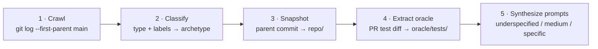

# TaskFlow

TaskFlow is FACET's validation case: a pipeline that turns a well-maintained
repository into [Experiment Packages](../reference/glossary.md). The premise — a
repo with conventional git and GitHub practices already contains the three
scenario types an agent evaluator needs (bug-fix, feature-add, refactor), each
paired with its context (the issue), its solution (the PR), and its oracle (the
regression test).

- [The idea](#the-idea)
- [The five stages](#the-five-stages)
- [What gets produced](#what-gets-produced)
- [Reproducibility](#reproducibility)

## The idea

The first consumer is the fixture `facet-eval/use-case-taskflow`, a small Python
CLI built deliberately with the practices TaskFlow expects: PR subjects like
`<type>(<scope>): <subject> (#<n>)`, structured issue and PR templates, `Closes
#N` in every PR body, a linear squash-merged `main`, and a regression test added
in each bug-fix PR.

## The five stages



1. **Crawl** — `git log --first-parent main` lists squash-merges; a subject parser extracts `type`, `scope`, and PR number; the GitHub API resolves each PR to the issue it closes.
2. **Classify** — `type` and `type:bug`/`type:feat`/`type:refactor` labels set the scenario archetype; `area:*` labels feed the prompt's scope.
3. **Snapshot** — the parent commit of the squash-merge becomes `scenarios/<id>/repo/`, the pre-PR tree.
4. **Extract oracle** — files under `tests/` added or modified in the PR diff go to `scenarios/<id>/oracle/tests/` (invisible to the agent), and a generated `oracle/run.sh` runs `pytest -q` over them, emitting `[task_id] PASS/FAIL`. For refactors, where the oracle is *do not break the existing suite*, `run.sh` runs the whole suite against the post-run workspace.
5. **Synthesize prompts** — three levels from the issue and PR body: `underspecified` (issue title only), `medium` (title + Problem/Reproduction), `specific` (adds Acceptance criteria and referenced file names).

Only stage 5 uses an LLM. The rest is deterministic.

## What gets produced

A scenario directory FACET can run directly, for example PR #14
(`fix(db): WAL + IMMEDIATE`, issue #13):

```
scenarios/taskflow-bugfix-pr14/
  meta.yaml                  # source: { pr: 14, issue: 13, type: fix, labels: [...] }
  repo/                      # snapshot of the pre-PR #14 state
  oracle/
    tests/test_concurrency.py
    run.sh                   # pytest -q tests/test_concurrency.py
  prompts/
    underspecified.md
    medium.md
    specific.md
```

These plug straight into a [spec](../reference/experiment-spec.md) as scenarios.

## Reproducibility

TaskFlow writes a `taskflow.lock.json` next to the Experiment Package with commit
SHAs, PR and issue numbers, hashes of the extracted tests, and the prompt-template
version. Two runs of TaskFlow over the same repository and lock produce identical
Experiment Packages — the same input-reproducibility model FACET applies to runs.
See [Reproducibility](../reference/reproducibility.md).
