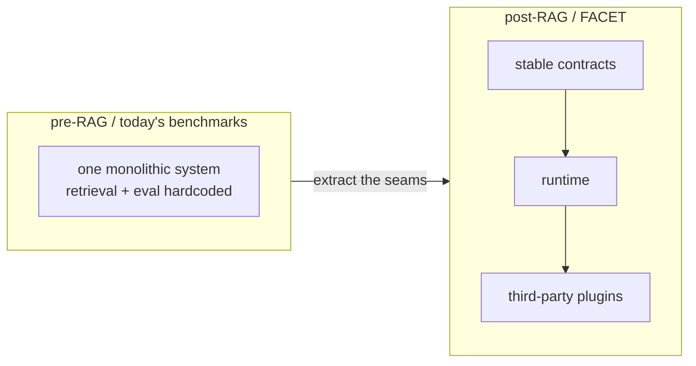

# The evaluation layer

- [The gap](#the-gap)
- [The RAG analogy](#the-rag-analogy)
- [Three conditions that make FACET a layer](#three-conditions-that-make-facet-a-layer)

## The gap

Today's coding-agent benchmarks measure whole agents, not the factors inside
them. Each new benchmark hardcodes its own harness, its own oracle format, and
its own metric set. When you want to vary the model, the context-gathering
strategy, or the prompt, you rewrite the harness from scratch. No shared
contracts, no plugin ecosystem.

That coupling also hides which layer earns a result. The same model — Claude
Opus 4.5 — scores anywhere from 46% to 80.9% on SWE-bench Verified depending on
the scaffold around it. List the model and the agent loop under one name and you
cannot attribute the gain to either.

## The RAG analogy

Retrieval-augmented generation went through the same shift. Before the RAG
paper, question-answering systems hardcoded their retrieval. After it, retriever,
ranker, prompt-composer, and index store became swappable components over stable
contracts, and a plugin ecosystem (LangChain, LlamaIndex, Haystack, later MCP)
grew without forking the base system. RAG also produced evaluation layers that
check whether a pipeline retrieves and answers well.

Coding-agent evaluation sits at the pre-RAG moment. FACET is the missing layer:
explicit contracts over the decisions that currently stay welded inside an opaque
harness.

## Three conditions that make FACET a layer

A layer, not a monolithic app, holds when three conditions are true. FACET meets
all three by construction:

1. **Stable public contracts in a minimal-dependency SDK.** See [`@facet/sdk`](packages/sdk.md).
2. **A runtime that executes those contracts without binding to one implementation.** See [`@facet/core`](packages/core.md).
3. **External plugins that add behavior without touching the runtime.** See [Extending FACET](guides/extending.md).

The payoff: a future `@facet/harness-aider` or a third-party metric plugs into
the same sockets FACET's own builtins use, with no fork. The
[Architecture](architecture.md) doc shows how.
