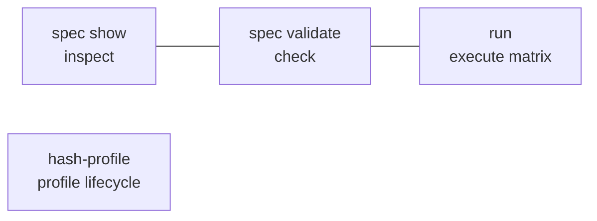

# CLI reference

The `facet` CLI is the single driver of the framework. After `pnpm build`, run it
with `pnpm facet <command>`.

- [`spec show`](#spec-show)
- [`spec validate`](#spec-validate)
- [`hash-profile`](#hash-profile)
- [`run`](#run)



## `spec show`

```bash
pnpm facet spec show <package-path>
```

Prints the parsed, resolved spec. Use it to confirm how a spec is interpreted
before running.

## `spec validate`

```bash
pnpm facet spec validate <package-path>
```

Validates the spec against the Zod schema composed from the active registries,
verifies each profile preset's recorded hash against its live directory, and
checks that every scenario declares every required `prompt_id`. Exit code is
non-zero on any failure.

## `hash-profile`

```bash
pnpm facet hash-profile <profile-package>
```

Recomputes the SHA-256 of a profile package's canonicalized directory and writes
it back to `package.json#facet.hash`. Run it after editing a preset's `profile/`
contents. See [Profile presets](../packages/presets.md) and
[Reproducibility](../reference/reproducibility.md).

## `run`

```bash
pnpm facet run <package-path>           # full matrix → Result Bundle
pnpm facet run <package-path> --single  # first cell only, for debugging
```

Executes the experiment. `run` loads the harness and plugins, validates the spec,
expands the factor matrix, runs each cell in an isolated workspace, and writes a
[Result Bundle](../reference/result-bundle.md) to `result-<spec.id>-<timestamp>/`.
`--single` runs only the first matrix cell. The
[run lifecycle](../reference/run-lifecycle.md) doc details every phase.

> Schema and runner edits require `pnpm build` before `pnpm facet` exercises
> them — the CLI runs the compiled `dist/`.
