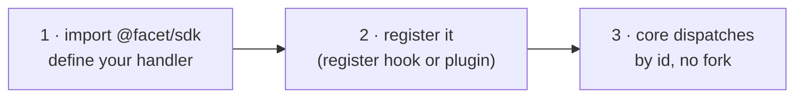

# Extending FACET

Every extensible piece of FACET lands through one pattern: write a `defineX()`
object against the [SDK](../packages/sdk.md), register it, and the
[core](../packages/core.md) dispatches it by `id`. You never fork the runtime.

- [The three-move pattern](#the-three-move-pattern)
- [Pick your seam](#pick-your-seam)
- [Wiring a plugin into a spec](#wiring-a-plugin-into-a-spec)
- [Distributing a profile preset](#distributing-a-profile-preset)

## The three-move pattern



1. **Contract** — depend only on `@facet/sdk` (zero runtime deps) and call the matching `defineX()` helper. It stamps `id`, `version`, and schema.
2. **Register** — expose a `register(registries)` hook (for a harness) or ship the handler as a plugin the spec lists in `metadata.plugins[]`.
3. **Dispatch** — the validator recomposes its Zod schema from the populated registries, and the runner dispatches by `id`. No core file names your extension.

## Pick your seam

| You want to… | Implement | Builtin example |
|---|---|---|
| add an agent under test | `HarnessAdapter` | Pi |
| add a kind of varying factor | `FactorKindHandler` | `model_swap` |
| derive a new metric over the trace | `MetricKindHandler` | `tool_call_count` |
| add a post-run evaluation layer | `EvaluatorLayerHandler` | `oracle_script` |
| add an output format | `OutputEmitterHandler` | `results_table_csv` |
| isolate workspaces differently | `WorkspaceStrategyHandler` | `git_worktree` |
| add a trace event type | `TraceEventKind` | `tool_execution_start` |
| add harness-specific `extensions.yaml` blocks | `ExtensionsContribution` | Pi's `language_servers` |

Each contract's interface lives in `packages/sdk/src/`. The
[seam table](../packages/sdk.md#the-eight-seams) describes responsibilities.

## Wiring a plugin into a spec

A plugin is an npm package or local path that exports a `register(registries)`
hook. List it in the spec:

```yaml
metadata:
  harness:
    id: pi
    package: "@facet/harness-pi"
    version: 0.70.0
  plugins:
    - "@your-scope/facet-metric-cyclomatic"   # npm
    - "./plugins/security-scan"                # local path
```

At `facet run`, `loadPlugins` imports each ref and calls its `register` hook
before the spec parser recomposes its schema. From then on your new metric kind,
evaluator layer, or emitter is valid spec syntax.

## Distributing a profile preset

A new agent configuration ships as a profile package — no code, just a
`profile/` directory and a `package.json#facet` manifest. Build it, hash it, and
reference it at an `extension_select` factor level:

```bash
pnpm facet hash-profile @your-scope/preset-pi-myconfig
```

See [Profile presets](../packages/presets.md) for the manifest and directory
layout, and [Reproducibility](../reference/reproducibility.md) for why the hash
matters.
