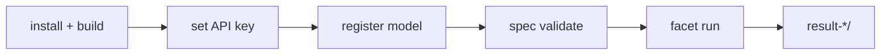

# Quickstart — run `ring-default-specific`

This walks through one real experiment end to end. It tests one model with the
`default` profile across three compound scenarios (Python, Haskell, C) using the
`specific` prompt: a 3-run matrix.

- [Prerequisites](#prerequisites)
- [1 · Install and build](#1--install-and-build)
- [2 · Set your API key](#2--set-your-api-key)
- [3 · Register the model](#3--register-the-model)
- [4 · Validate the spec](#4--validate-the-spec)
- [5 · Run](#5--run)
- [Swapping the model](#swapping-the-model)

## Prerequisites

- Node.js 22+ and pnpm 9
- An [OpenRouter](https://openrouter.ai) account and API key

## 1 · Install and build

From the repository root:

```bash
pnpm install --frozen-lockfile
pnpm build
```

## 2 · Set your API key

The CLI reads `${PROVIDER}_API_KEY` for each provider declared in the spec. This
experiment uses OpenRouter, so copy the example env file and fill in the key:

```bash
cp .env.example .env
# edit .env → OPENROUTER_API_KEY=sk-or-...
```

## 3 · Register the model

`harness-pi` looks up models against Pi's `ModelRegistry`, which today reads
`~/.pi/agent/models.json`. The experiment ships its model declaration next to its
spec in `examples/ring-default-specific/models.json`. Merge it into your global
file once:

```bash
node -e "
const fs = require('fs'), path = require('path'), os = require('os');
const globalPath = path.join(os.homedir(), '.pi/agent/models.json');
const local = JSON.parse(fs.readFileSync('examples/ring-default-specific/models.json', 'utf8'));
const global = fs.existsSync(globalPath)
  ? JSON.parse(fs.readFileSync(globalPath, 'utf8')) : { providers: {} };
for (const [prov, decl] of Object.entries(local.providers)) {
  const bucket = (global.providers[prov] ??= { models: [] });
  for (const m of decl.models) {
    const i = bucket.models.findIndex(x => x.id === m.id);
    if (i >= 0) bucket.models[i] = m; else bucket.models.push(m);
  }
}
fs.writeFileSync(globalPath, JSON.stringify(global, null, 2) + '\n');
console.log('merged → ' + globalPath);
"
```

The merge preserves your existing entries.

## 4 · Validate the spec

```bash
pnpm facet spec validate examples/ring-default-specific
```

This checks the schema, verifies each preset's hash against its live directory,
and confirms every scenario declares the required `prompt_id`. See the
[CLI reference](cli.md).

## 5 · Run

```bash
pnpm facet run examples/ring-default-specific
```

Results land in a fresh `result-ring-default-specific-001-<timestamp>/` at the
repository root. To debug, run a single cell first:

```bash
pnpm facet run examples/ring-default-specific --single
```

Read the output with the [Result Bundle](../reference/result-bundle.md) guide.



## Swapping the model

The model is just one factor level. Point it at any OpenRouter model by editing
`varying_factors[model].levels` in `spec.yaml`:

```yaml
- id: model
  levels:
    - id: my-model
      provider: openrouter
      model_id: "qwen/qwen3.5-9b"   # any OpenRouter model id
```

Prefer a **free** model (`:free` suffix on OpenRouter) to avoid spending tokens
while you learn the tool — `inclusionai/ring-2.6-1t:free` is the default here.
The spec also caps spend with `environment.max_total_cost_usd: 0.5`, enforced by
the runtime's budget tracker.

If your chosen model is not already in `~/.pi/agent/models.json`, add a
declaration for it (same shape as `models.json`) before running. To understand
every spec field, see the [Experiment spec](../reference/experiment-spec.md).
