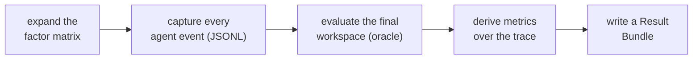
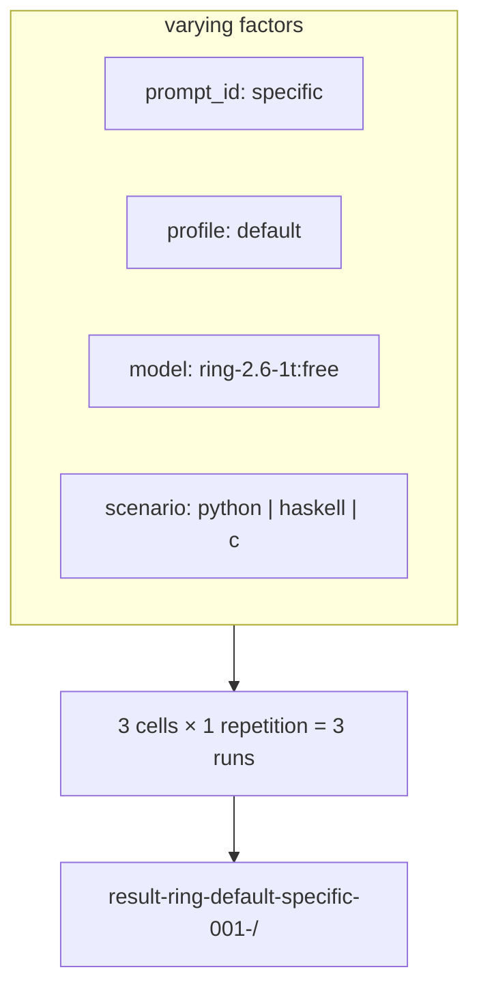

# Overview

- [What FACET is](#what-facet-is)
- [The run](#the-run)
- [Factors, matrix, bundle](#factors-matrix-bundle)
- [What ships in the box](#what-ships-in-the-box)
- [Where to go next](#where-to-go-next)

## What FACET is

FACET evaluates code agents by treating every knob of an agent as a declarable
variable. Model, tool allowlist, system prompt, extensions, agent definitions,
prompt phrasing, scenario, and harness params each become a factor you can hold
fixed or vary. You write one declarative `spec.yaml`, and FACET runs the full
matrix and writes a verifiable Result Bundle.

The framework is the artifact. The companion thesis uses FACET to study which
factors most affect agent quality, but FACET itself stays agnostic about which
question you ask.

## The run

The unit of work is the **run**: one execution of the harness over an isolated
workspace, with a fixed model, profile, prompt, and scenario. A run continues
until the agent ends its session or the timeout fires. Everything FACET produces
is built out of runs.

From a spec, FACET does five things per experiment:

## Factors, matrix, bundle

A **factor** is one independent variable; each value it can take is a **level**.
The runner takes the Cartesian product of all varying factors, multiplies it by
`design.repetitions`, and produces one `RunConfig` per cell.

Repetitions matter because runs are stochastic. Two runs with identical inputs
produce different traces, and that variance is the signal you want to measure.
See [Design principles](design-principles.md).

## What ships in the box

`facet-system` is a pnpm monorepo with four kinds of package:

| Package | Role |
|---|---|
| [`@facet/sdk`](packages/sdk.md) | The extension contracts. Zero runtime deps. |
| [`@facet/core`](packages/core.md) | The runtime: validator, runner, tracer, bundle writer, CLI. |
| [`@facet/harness-pi`](packages/harness-pi.md) | The reference harness for the Pi coding agent. |
| [`@facet/preset-pi-*`](packages/presets.md) | Six distributable profile packages. |

Two pieces sit around the core and complete the reproducibility cycle: the
[CI layer](ecosystem/ci-layer.md) runs the framework on shared infrastructure,
and [TaskFlow](ecosystem/taskflow.md) generates Experiment Packages from real
repositories.

## Where to go next

- New to the idea? Read [The evaluation layer](evaluation-layer.md).
- Want to run something now? Go to the [Quickstart](guides/quickstart.md).
- Want the structure? Read [Architecture](architecture.md).
- Need a term defined? Check the [Glossary](reference/glossary.md).
