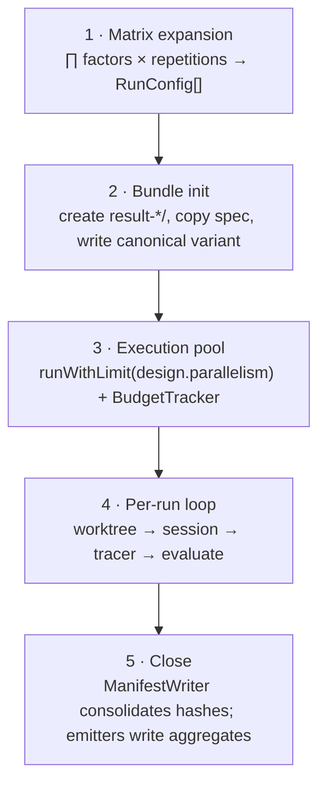

# `@facet/core`

- [Why it exists](#why-it-exists)
- [Registries and the validator](#registries-and-the-validator)
- [The runner](#the-runner)
- [Builtins](#builtins)
- [Workspace isolation](#workspace-isolation)

## Why it exists

`@facet/core` is the framework runtime and the canonical consumer of the
[SDK](sdk.md). It implements the validator, runner, tracer, evaluator, bundle
writer, registries, CLI, and the eager-registered builtins. It consumes the SDK
exactly like any third party — no privileged access to the contracts. Its
dependencies are `@facet/sdk`, `commander`, `execa`, `simple-git`, `yaml`, and
`zod`.

## Registries and the validator

The central pattern is the **registry**. Each contract has a registry of the same
name (`factor-kind-registry`, `metric-kind-registry`, and so on). Builtins
register on module load through the same `defineX()` helpers a plugin uses.

The validator builds the Experiment Spec's Zod schema from the active registries.
The subschemas for `evaluator.layers[].type`, `analysis.emit[]`, and
`environment.workspace_strategy` are derived from the registries, not fixed
constants. Register a new evaluator layer and the parser recognizes it without a
core edit.

Dynamic loading happens at three points during `facet run` (the
[Architecture](../architecture.md#dynamic-loading) doc has the sequence):

1. `loadHarness(packageName, contextDir)` imports `spec.metadata.harness.package`, validates the default export is a `HarnessAdapter`, and calls its optional `register(registries)` hook.
2. `loadPlugins(refs, contextDir, registries)` does the same for each `spec.metadata.plugins[]` entry. Refs starting with `@` or bare names resolve via npm; others as local paths.
3. `loadProfilePackage(ref, contextDir)` resolves an `extension_select` level against `node_modules`, reads `package.json#facet`, validates it, and verifies the recorded hash against the live directory.

After all three, the spec parser recomposes its schema and re-parses. No core
component knows a plugin's name — dispatch is always by `id`.

## The runner

The runner executes the validated spec in five phases:

- **Phase 1** — each `FactorKindHandler.expand()` contributes its axis; the runner takes the Cartesian product, multiplies by `design.repetitions`, and materializes one `RunConfig` per cell via each kind's `apply()`.
- **Phase 3** — the `BudgetTracker` stops new starts when `max_total_cost_usd` is exceeded.
- **Phase 4** — `git_worktree` builds a one-shot repo from `scenarios/<id>/repo/`; the harness runs the session; every event reaches the `Tracer`, which writes `trace.jsonl`; `evaluateRun` runs the oracle and derives Layer-2 metrics. Artifacts are saved atomically with `rename(2)`.

Every edge is a direct TypeScript call. The core never parses `stdout`. See the
full [run lifecycle](../reference/run-lifecycle.md).

## Builtins

All in `packages/core/src/builtins/`, registered through `defineX()`:

| Seam | Builtins |
|---|---|
| factor kinds | `prompt_swap`, `extension_select`, `model_swap`, `model_param` |
| trace event kinds | `agent_start`, `message_text_delta`, `tool_execution_start`, `tool_execution_end`, `turn_start`, `turn_end` |
| evaluator layer | `oracle_script` |
| output emitters | `results_table_csv`, `results_table_jsonl` |
| workspace strategy | `git_worktree` |

That the builtins use the plugin path is the evidence the SDK/core split is not
ornamental.

## Workspace isolation

`git_worktree` guarantees no run contaminates another. It was chosen over Docker
for three reasons: startup costs tens of milliseconds rather than seconds, outputs
copy with `cp -r` without intermediate packaging, and concurrency is controlled
with a serial mutex over `git worktree add` (which is not thread-safe). For other
needs, the `WorkspaceStrategyHandler` contract admits Docker, FUSE, or VM
strategies without touching the runner.
