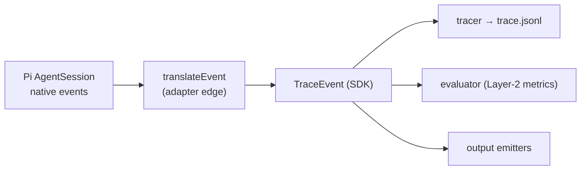

# `@facet/harness-pi`

- [Why it exists](#why-it-exists)
- [The translate boundary](#the-translate-boundary)
- [What the adapter contributes](#what-the-adapter-contributes)
- [The clarification fallback](#the-clarification-fallback)

## Why it exists

`@facet/harness-pi` is the first and only complete harness in the repository. It
wraps [`@mariozechner/pi-coding-agent`](sdk.md) and serves as the reference
implementation of the [`HarnessAdapter`](sdk.md#the-eight-seams) contract. It is
one of N possible harnesses; a future `@facet/harness-aider` or
`@facet/harness-openhands` would have the same shape.

Its default export is `defineHarness({ id: "pi", version, runSession })`.
`runSession` builds a Pi `AgentSession` (with `createAgentSession`, an isolated
`AuthStorage`, `SessionManager.inMemory`, and `noExtensions: true`), subscribes
the listeners, and advances turns until the agent closes the session or the
timeout fires.

## The translate boundary

This is the key piece. Pi's native events have an agent-specific shape; the SDK's
`TraceEvent`s are a generic abstraction. `translateEvent`
(`packages/harness-pi/src/translate.ts`) converts at the adapter's edge and emits
`TraceEvent`s through the `onEvent` callback the runner passes in. Nothing
downstream — tracer, evaluator, emitters — ever sees the Pi shape.

A `harness-aider` would implement its own `translateEvent`; downstream nothing
changes. This boundary is what makes the harness substitutable.

## What the adapter contributes

Through its `register(registries)` hook the adapter adds two harness-specific
things the core never names.

**Three metric kinds** (any profile can use them by listing them in
`extensions.yaml`'s `metrics[]`):

| Metric kind | Measures |
|---|---|
| `tool_call_count` | calls per tool type |
| `tool_result_marker_count` | occurrences of a marker in tool stdout |
| `tool_call_max_depth` | maximum depth of the tool-call tree |

**Two extensions contributions** that become part of `extensions.yaml` syntax:

- `pinned_agents` — markdown sub-agent definitions the adapter mounts on disk before the session, with `${RUN_MODEL}` substitution.
- `language_servers` — a language → LSP-binary map, consumed by presets like [`@facet/preset-pi-lsp`](presets.md).

## The clarification fallback

Sometimes a turn produces text with no tool calls — common with underspecified
prompts, when the model asks for clarification. `driveClarificationLoop` retries
up to three times with one fixed English line:

> Proceed with what you have. No additional information is available. Use your
> judgment to complete the task.

Without it, runs on vague prompts would hang. The number of triggers per run is
recorded as the descriptive metric `clarification_requests_count` (visible in
`summary.json`).
