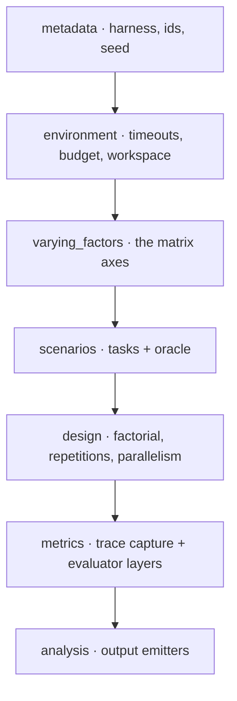

# Experiment spec

The `spec.yaml` captures one complete experiment declaratively. This page walks
its sections using `examples/ring-default-specific/spec.yaml`.

- [metadata](#metadata)
- [environment](#environment)
- [varying_factors](#varying_factors)
- [scenarios](#scenarios)
- [design](#design)
- [comparisons](#comparisons)
- [metrics](#metrics)
- [analysis](#analysis)



## metadata

Identity and the harness binding. `harness.package` is what the CLI dynamically
imports; `version` pins the harness.

```yaml
metadata:
  id: ring-default-specific-001
  name: "Ring Default — ring-2.6-1t:free, specific prompt only"
  version: "0.1.0"
  seed: 42                       # base seed; each run derives its own
  framework_version: "0.1.0"
  harness:
    id: "pi"
    package: "@facet/harness-pi"
    version: "0.70.0"
```

An optional `plugins: []` lists extra extensions to load (see
[Extending FACET](../guides/extending.md)).

## environment

Per-run limits and isolation.

```yaml
environment:
  timeout_per_run_seconds: 900
  max_tokens_per_run: 200000
  max_total_cost_usd: 0.5        # enforced by the runtime budget tracker
  workspace_strategy: "git_worktree"
```

## varying_factors

The matrix axes. Each factor has an `id` and `levels`. A factor's *kind*
determines how its levels materialize into a `RunConfig`:

| Factor kind | Varies |
|---|---|
| `prompt_swap` | which prompt file a scenario uses (`prompt_id`) |
| `extension_select` | which profile package (preset) is active |
| `model_swap` | provider + model id |
| `model_param` | a harness param such as `temperature` |

```yaml
varying_factors:
  - id: profile
    levels:
      - id: default
        ref: "@facet/preset-pi-default"
        hash: "sha256:4177c4c6…"   # verified against the live preset
  - id: model
    levels:
      - id: ring-2-6-1t-free
        provider: openrouter
        model_id: "inclusionai/ring-2.6-1t:free"
```

## scenarios

Each scenario is a directory with `meta.yaml`, a `repo/` snapshot, prompts, and
an `oracle/`. The spec references it and records its hash.

```yaml
scenarios:
  - id: compound-python
    ref: "scenarios/compound-python"
    hash: "..."
```

A scenario's `meta.yaml` declares its prompts and required binaries:

```yaml
id: compound-python
language: python
prompts:
  - { id: medium,   file: prompts/medium.md }
  - { id: specific, file: prompts/specific.md }
requires_binaries: ["python3"]
```

The framework enforces that every scenario declares every `prompt_id` the
`prompt_swap` factor selects.

## design

How the matrix is built and run.

```yaml
design:
  type: full_factorial
  repetitions: 1        # multiplies every matrix cell
  parallelism: 4        # concurrent runs
```

Matrix size = ∏(factor levels) × repetitions. Here 1 prompt × 1 profile ×
1 model × 3 scenarios × 1 = **3 runs**.

## comparisons

Declares the questions the experiment answers, by stating which factor varies and
which are held constant. Descriptive metadata for analysis tooling.

```yaml
comparisons:
  - id: scenario_language
    across: scenario
    holding_constant: [profile, model, prompt_id]
```

## metrics

Two parts. `trace.capture` lists the signals recorded per turn. `evaluator.layers`
defines post-run scoring; the builtin `oracle_script` runs a script and parses
`[task_id] PASS/FAIL`.

```yaml
metrics:
  trace:
    capture: [tool_calls, tokens_in, tokens_out, latency_ms_per_turn, file_reads, context_size_per_turn]
  evaluator:
    layers:
      - id: correctness
        type: oracle_script
        script: "oracle/run.sh"
        pass_condition: "exit_code == 0"
  judge: null
```

## analysis

Selects which output emitters produce aggregated results.

```yaml
analysis:
  type: none
  emit:
    - results_table_csv
```

The run writes everything into a [Result Bundle](result-bundle.md).
