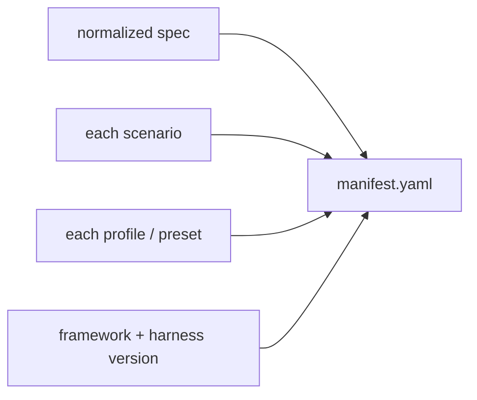
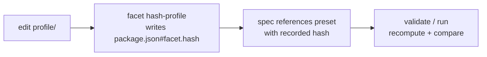

# Reproducibility

FACET reproduces **inputs, not outputs**. Output is stochastic by construction,
so the manifest hashes only the inputs. Same Experiment Package plus same pinned
presets plus same harness version equals the same experiment, bit-for-bit on the
inputs.

- [What gets hashed](#what-gets-hashed)
- [Canonical normalization](#canonical-normalization)
- [Pinning](#pinning)
- [The profile hash lifecycle](#the-profile-hash-lifecycle)
- [Why outputs are not hashed](#why-outputs-are-not-hashed)

## What gets hashed

At the close of a run, the `ManifestWriter` records SHA-256 hashes of:

Each profile hash is recomputed from the live directory and verified against the
value recorded in the spec and the package manifest. A mismatch fails the run.

## Canonical normalization

Before hashing, the spec is normalized to a canonical YAML form
(`spec.normalized.yaml`, kept in the [bundle](result-bundle.md)). The manifest
records both `spec.hash` (verbatim input) and `spec.normalized_hash`. Normalizing
first means cosmetic edits — key order, whitespace, quoting — do not change the
hash, so two equivalent specs compare equal.

## Pinning

Two versions are pinned so a replay uses the same code:

- `metadata.harness.version` pins the harness (recorded as `pi_version` in the manifest).
- `metadata.framework_version` records the framework version.

Profile presets are pinned by hash at each `extension_select` level (see below),
and `harnessVersionRange` in the [preset manifest](../packages/presets.md#the-manifest)
constrains which harness versions a preset accepts.

## The profile hash lifecycle

`facet hash-profile <pkg>` recomputes the canonicalized directory hash and writes
it back to the manifest. Every `facet spec validate` and the start of every run
compares the recorded hash against the live directory; provenance lands in
`manifest.provenance.profiles[]`.

## Why outputs are not hashed

Two runs with identical inputs produce different traces. That variance is the
signal the experiment measures, and `design.repetitions` multiplies each matrix
cell to model it statistically. Hashing outputs would treat that signal as
corruption. The model of non-determinism is explicit: inputs are reproducible,
traces are signal, failed runs are data. See [Design principles](../design-principles.md).
