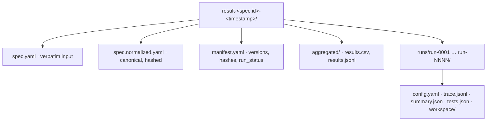

# Result Bundle

A run produces one self-contained `result-*/` directory. It holds the inputs
(for reproducibility), per-run artifacts, and aggregated tables.

- [Structure](#structure)
- [Per-run files](#per-run-files)
- [Aggregated and manifest](#aggregated-and-manifest)
- [Reading the results](#reading-the-results)

## Structure



## Per-run files

Each `runs/run-NNNN/` directory:

| File | Contents |
|---|---|
| `config.yaml` | the concrete factor values for this run (prompt, profile, model, scenario, repetition, `derived_seed`) |
| `trace.jsonl` | one `TraceEvent` per line; first line is a `_meta` header (harness + version) |
| `summary.json` | status, duration, token counts, cost, `tasks_passed`/`tasks_total`, `clarification_requests_count` |
| `tests.json` | the oracle's `EvaluationResult` — per-task and per-regression PASS/FAIL, exit code, captured stdout/stderr |
| `workspace/` | the post-run workspace, with `.git` removed |

A `summary.json` excerpt:

```json
{
  "status": "partially_completed",
  "tokens_in": 7286, "tokens_out": 710,
  "tasks_passed": 1, "tasks_total": 3,
  "regression_tests_passed": 4, "regression_tests_total": 4
}
```

A `status` of `partially_completed` with `tasks_passed: 1` is data about the
agent, not a framework error. See [Design principles](../design-principles.md).

## Aggregated and manifest

`aggregated/results.csv` has one row per run with the factor values and metrics;
`results.jsonl` carries the same dataset. `manifest.yaml` consolidates:

- `framework_version`, `pi_version` (the harness version)
- `spec.hash` and `spec.normalized_hash` (SHA-256)
- a hash per scenario, per profile, and per preset, recomputed and verified at close
- the per-run `runs[]` list with status and token/cost totals

```yaml
spec:
  hash: sha256:76dc6cf…
  normalized_hash: sha256:7262679…
profiles:
  - id: default
    hash: sha256:4177c4c6…       # verified against the live preset
```

Hashes cover **inputs only**. See [Reproducibility](reproducibility.md).

## Reading the results

- Did the agent pass? Open `tests.json` (`passed`, `per_task[]`) or scan `tasks_passed` in `aggregated/results.csv`.
- What did the agent do? Replay `trace.jsonl`.
- How much did it cost? Sum `cost_usd` in `summary.json` across runs.
- Is the run reproducible? Compare `manifest.yaml` input hashes against another bundle.
