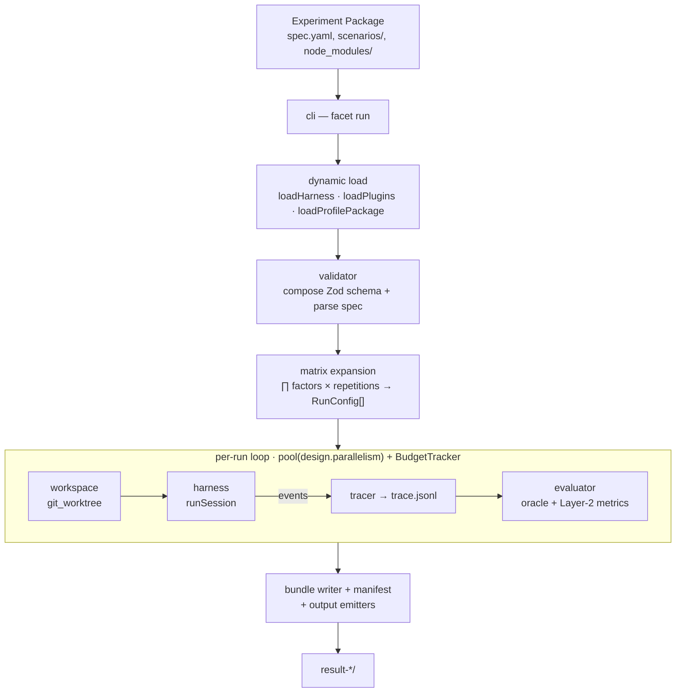

# Run lifecycle

What `facet run <package>` does, from Experiment Package to `result-*/`. Every
edge is a direct TypeScript call; the core never parses `stdout`.

- [The full flow](#the-full-flow)
- [Load](#load)
- [Validate](#validate)
- [Expand](#expand)
- [Per-run loop](#per-run-loop)
- [Close](#close)

## The full flow

## Load

The CLI populates the registries before anything else. It imports the harness
declared in `spec.metadata.harness.package`, calls its `register(registries)`
hook, then imports each plugin in `metadata.plugins[]` and each profile package
referenced by an `extension_select` level. See
[Architecture → dynamic loading](../architecture.md#dynamic-loading).

## Validate

The spec parser composes its Zod schema from the now-populated registries and
parses the spec. Subschemas for evaluator layers, output emitters, and the
workspace strategy come from the registries, so plugin-provided kinds validate
without a core edit.

## Expand

Each `FactorKindHandler.expand()` contributes its axis. The runner takes the
Cartesian product, multiplies by `design.repetitions`, and materializes one
`RunConfig` per cell via each kind's `apply()`. The `BundleWriter` then creates
`result-<spec.id>-<timestamp>/`, copies the spec verbatim, and writes the
canonical variant used for hashing.

## Per-run loop

A pool dispatches cells up to `design.parallelism`; a `BudgetTracker` stops new
starts once `max_total_cost_usd` is exceeded. For each cell:

1. `git_worktree` builds a one-shot repo from `scenarios/<id>/repo/` and opens an ephemeral worktree.
2. The harness runs the session; each event passes through the [translate boundary](../packages/harness-pi.md#the-translate-boundary) and reaches the `Tracer`, which appends to `trace.jsonl`.
3. `evaluateRun` runs the oracle and derives Layer-2 metrics.
4. Artifacts are written atomically with `rename(2)`.

## Close

The `ManifestWriter` consolidates SHA-256 hashes of the normalized spec,
scenarios, profiles, and presets (recomputed and verified at close), plus the
`run_status` list. The output emitters write `aggregated/results.csv` and
`aggregated/results.jsonl`. The result is a
[Result Bundle](result-bundle.md).
